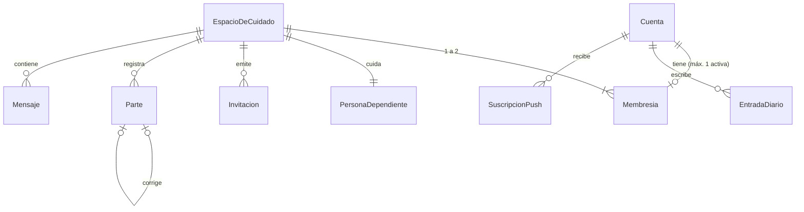

# Kalma — Documento de arquitectura

26 de septiembre de 2026 · René

## Contexto y alcance

Kalma es una PWA B2C para que una familia y una cuidadora coordinen el cuidado diario de una persona dependiente en España. Se rehace desde cero, con una base de ingeniería de software sólida y *Clean Architecture* como marco.

- **Mercado:** familia directa (B2C), sin agencias.
- **Stack:** ASP.NET Core (.NET), EF Core, PostgreSQL, React/TypeScript como PWA.
- **Hosting:** VPS de Hostinger en un centro de datos de la UE (Fly.io descartado).
- **Repositorio:** uno solo, con backend y frontend.
- **MVP gratuito.** Los pagos quedan como hueco preparado, no construido.
- **Fuera del MVP:** ficha clínica, capa `Organizacion`, pagos, doble factor.

## Atributos de calidad

Estas tres prioridades desempatan cualquier decisión técnica, en este orden.

| Prioridad | Atributo | Cómo se garantiza |
| --- | --- | --- |
| 1 | Fácil de cambiar y testear | Regla de dependencias de *Clean Architecture* + TDD estricto |
| 2 | Rápida y barata de operar | Monolito modular, una sola instancia, mínimos procesos en segundo plano |
| 3 | Segura (registro y, más adelante, pagos) | ASP.NET Identity; pagos delegados a un proveedor externo |

Además hay un requisito que no se negocia: **registrar partes y enviar mensajes sin conexión**. Es la mayor fuente de complejidad del proyecto.

## Casos de uso del MVP

Ocho casos de uso cubren el MVP. El primero es el núcleo del dominio y abre el primer ciclo de TDD.

| # | Caso de uso | Actor | ¿Sin conexión? |
| --- | --- | --- | --- |
| CU-01 | Registrar parte de tramo (y corregirlo con una entrada nueva) | Cuidador, Familiar | Sí |
| CU-02 | Enviar mensaje de chat | Miembro del espacio | Sí (cola de envío) |
| CU-03 | Enviar alerta | Miembro del espacio | No: se bloquea y se sugiere llamar |
| CU-04 | Recibir notificación push (alertas y chat por separado) | Miembro del espacio | — |
| CU-05 | Registrar cuenta y acceder (email + contraseña, email verificado) | Familiar, Cuidador | No |
| CU-06 | Invitar a un miembro al espacio | FamiliarAdministrador | No |
| CU-07 | Consultar informe de 7 días y descargarlo en PDF | Miembro del espacio | No |
| CU-08 | Escribir en el diario privado y consultar recursos de apoyo | Cuidador | Sí (diario por la cola de envío) |

La persona dependiente es una **entidad** del dominio: tiene datos, pero no tiene cuenta ni acceso.

## Modelo de dominio y reglas de negocio

El `EspacioDeCuidado` es el centro del modelo: casi todo cuelga de él. La única excepción es el diario, que pertenece a la `Cuenta`.



**Conceptos clave**

- **Cuenta:** quién eres (email + contraseña). Sobrevive a la salida de un espacio.
- **Membresía:** en qué espacio estás y con qué rol (Cuidador, Familiar, FamiliarAdministrador).
- **Parte:** tramo, checklist fijo, texto libre y medicación tomada (sí, no o no aplica). Guarda la hora del tramo como valor propio.
- **Mensaje:** tipo `chat` o `alerta`. La alerta es un mensaje con prioridad, no un subsistema aparte.
- **Tramo:** objeto de valor. Son 4 al día, iguales para todos, en hora de Europe/Madrid.

**Reglas de negocio**

1. Un espacio tiene como máximo 2 membresías.
2. Una cuenta tiene como máximo 1 membresía activa a la vez.
3. Solo el FamiliarAdministrador invita.
4. El administrador siempre es un Familiar. No puede irse sin transferir la administración a otro Familiar; si no hay ninguno, debe borrar el espacio.
5. Una cuidadora nunca crea espacios y no se registra sin invitación.
6. Un parte enviado no se edita. Se corrige con un parte nuevo que referencia al original.
7. Los datos se conservan hasta que se borra el espacio.
8. Un espacio sin actividad durante 6 meses se borra, con aviso por email 30 días antes. Cuenta como actividad un parte, un mensaje o entrar en la app.
9. El diario pertenece a la cuenta de la cuidadora y se lo lleva si sale del espacio.

## Arquitectura

Kalma es un monolito modular con las 4 capas de *Clean Architecture*, tanto en el backend como en el frontend. Las dependencias siempre apuntan hacia dentro.

```
API ──► Infraestructura ──► Aplicación ──► Dominio
```

| Capa | Contiene | Depende de |
| --- | --- | --- |
| Dominio | Entidades y reglas: Parte, Espacio, Membresía, Tramo | Nada |
| Aplicación | Casos de uso e interfaces ("necesito guardar un parte") | Dominio |
| Infraestructura | EF Core, PostgreSQL, email, push, PDF, SignalR | Aplicación |
| API | Controladores HTTP, autenticación, composición | Todas |

**Módulos** (carpetas dentro de cada capa): Identidad, Espacios (membresías e invitaciones), Partes, Mensajería (chat y alertas), Diario, Informes, Notificaciones.

**Estructura del repositorio**

```
kalma/
├── backend/
│   ├── src/
│   │   ├── Kalma.Domain/
│   │   ├── Kalma.Application/
│   │   ├── Kalma.Infrastructure/
│   │   └── Kalma.Api/
│   └── tests/
│       ├── Kalma.Domain.Tests/
│       ├── Kalma.Application.Tests/
│       └── Kalma.Infrastructure.IntegrationTests/
├── web/
│   └── src/
│       ├── domain/   (TypeScript puro: tramos, reglas)
│       ├── app/      (casos de uso, cola de envío)
│       ├── infra/    (cliente API, IndexedDB, SignalR)
│       └── ui/       (componentes React: solo pintan)
└── docs/
    └── adr/
```

El compilador de .NET hace cumplir la regla: si Dominio intenta usar EF Core, el proyecto no compila porque no tiene esa referencia.

## Principios SOLID aplicados a Kalma

SOLID son cinco reglas para organizar clases e interfaces de modo que un cambio toque el menor código posible. Sirven directamente a la prioridad nº 1: fácil de cambiar y testear.

| Principio | Qué dice | Dónde se aplica en Kalma | Señal de que lo estás violando |
| --- | --- | --- | --- |
| **S** · Responsabilidad única | Un módulo debe responder ante un solo actor (cap. 7 de *Clean Architecture*) | El informe se reparte en tres piezas: `CalcularInforme` (qué datos ve la familia), `GeneradorPdfInforme` (formato) y `NotificadorInforme` (aviso del lunes) | Un `InformeService` que calcula, maqueta el PDF y envía la push: un cambio de diseño del PDF te obliga a tocar el cálculo |
| **O** · Abierto/cerrado | Se amplía añadiendo código, no modificando el existente | Los canales de aviso implementan `INotificador` (push, email). Añadir SMS es una clase nueva; los casos de uso no se tocan | Un `switch (canal)` que crece cada vez que añades un canal |
| **L** · Sustitución de Liskov | Cualquier implementación de una abstracción debe comportarse como promete su contrato | El repositorio real (EF Core) y el falso de los tests deben reaccionar igual ante un ID repetido: ambos "ya lo tengo", ninguno lanza excepción | Un test pasa con el repositorio falso y falla en producción |
| **I** · Segregación de interfaces | Ningún cliente debe depender de métodos que no usa | `RegistrarParte` solo necesita `IComprobadorMembresia` (¿es miembro?) e `IRepositorioPartes`, no un repositorio gigante del espacio | Una interfaz con 15 métodos y tests que tienen que simular 14 que no usan |
| **D** · Inversión de dependencias | Lo de dentro define interfaces; lo de fuera las implementa | Aplicación define `IRepositorioPartes`, `IEnviadorEmail`; Infraestructura las implementa. El reloj también se inyecta (`TimeProvider`) | Un `using Microsoft.EntityFrameworkCore` o un `DateTime.Now` dentro de Dominio o Aplicación |

**Una trampa de Liskov específica de Kalma (ADR-14).** Parecería natural que `Alerta` herede de `Mensaje`. Pero un mensaje se puede encolar sin conexión y una alerta no. Si `Alerta` hereda y lanza error al encolarse, ya no puede sustituir a `Mensaje`: se rompe Liskov. Solución: un único `Mensaje` con un `Tipo` (chat o alerta) y una regla que decide si se puede encolar. Composición antes que herencia.

**Inversión de dependencias en código.** El reloj es el ejemplo más útil para TDD, porque los tramos dependen de la hora:

```csharp
// Kalma.Application — define lo que necesita
public interface IRepositorioPartes
{
    Task<bool> Existe(Guid id);
    Task Guardar(Parte parte);
}

// El caso de uso recibe sus dependencias; no las crea
public sealed class RegistrarParte(
    IRepositorioPartes partes,
    IComprobadorMembresia membresias,
    TimeProvider reloj)
{
    // En los tests se pasa un reloj falso fijado a las 14:05
}
```

Sin inyectar el reloj, un test de "tramo de la tarde" solo pasaría si lo ejecutas por la tarde.

## Patrones de diseño por decisión

Dieciséis patrones cubren las decisiones del MVP. Un patrón solo entra si resuelve un problema que ya tienes: aplicar patrones "por si acaso" es el error más común del principiante.

**Estructura y dominio**

| Decisión | Patrón | Qué resuelve en Kalma |
| --- | --- | --- |
| ADR-29 · 4 capas | **Puertos y adaptadores** | Las interfaces de Aplicación son los puertos; EF Core, email o SignalR son adaptadores intercambiables |
| ADR-06, ADR-07 · todo cuelga del espacio | **Agregado** (DDD) con raíz `EspacioDeCuidado` | El propio agregado impide una tercera membresía: la regla "máx. 2" vive en un solo sitio |
| ADR-16 · tramos | **Objeto de valor** | `Tramo` no tiene identidad propia; dos tramos "Mañana" son iguales. Es inmutable y valida sus valores al crearse |
| ADR-10 · partes inmutables | **Método factoría** + objeto inmutable | `Parte.Registrar(...)` es la única forma de crear un parte válido; sin *setters*, nadie lo modifica después |
| ADR-13, ADR-25 · roles | **Política** (*authorization policies* de ASP.NET) | "Solo el administrador invita" se declara una vez y se reutiliza en cada endpoint |
| Invitaciones | **Máquina de estados** sencilla | Pendiente → Aceptada / Caducada / Revocada, con transiciones controladas por la entidad. Un `enum` basta; el patrón *State* de GoF sería excesivo |

**Datos y sincronización**

| Decisión | Patrón | Qué resuelve en Kalma |
| --- | --- | --- |
| ADR-29 · persistencia | **Repositorio** (uno por agregado) | Aplicación guarda y recupera sin saber que existe PostgreSQL |
| ADR-09 · cola sin conexión | **Outbox** (en el cliente) | Lo pendiente se guarda en IndexedDB y se envía en orden al volver la conexión |
| ADR-09 · reintentos | **Receptor idempotente** | El servidor reconoce un ID repetido y no duplica |
| ADR-21, ADR-27 · informe | **Separación de comandos y consultas** (CQRS ligero) | El informe es solo lectura: una consulta optimizada, sin pasar por el agregado. Misma base de datos, sin complicaciones |

**Comunicación entre módulos**

| Decisión | Patrón | Qué resuelve en Kalma |
| --- | --- | --- |
| ADR-08, ADR-02 · alertas y push | **Eventos de dominio** (Observer) | Mensajería publica `AlertaEnviada`; Notificaciones la escucha y envía la push. Mensajería no sabe que existen las push |
| Canales de aviso | **Strategy** | Push o email son estrategias de `INotificador`, elegidas por el tipo de aviso |
| ADR-28 · tiempo real | **Adaptador** | Aplicación habla con `INotificadorTiempoReal`; SignalR es solo una implementación |

**Pruebas**

| Decisión | Patrón | Qué resuelve en Kalma |
| --- | --- | --- |
| ADR-30 · TDD | **Dobles de prueba** (*fakes*) | Repositorios en memoria para tests de milisegundos |
| ADR-30 · infraestructura | **Humble Object** | Las piezas difíciles de testear se dejan casi sin lógica |
| Liskov | **Tests de contrato** | La misma batería de tests se ejecuta contra el repositorio falso y el real |

**Lo que se descarta a propósito**

- **Unit of Work propio:** el `DbContext` de EF Core ya lo es. Envolverlo en otra capa solo añade código.
- **Event sourcing:** los partes son de solo añadir, pero guardar todo el estado como eventos es una complejidad que el MVP no necesita.
- **Interfaces para pagos y `Organizacion`:** el hueco está en la arquitectura, no en el código. Crear la interfaz ahora sería especular (YAGNI).

## Sin conexión, tiempo real y notificaciones

Los datos viajan por HTTP; el tiempo real y las push son capas extra. Si fallan, la app sigue funcionando.

**Sin conexión (partes, mensajes y diario)**

- El cliente genera el ID de cada parte o mensaje (UUID) antes de enviarlo.
- Lo guarda en una cola de envío pendiente en IndexedDB (patrón *outbox*) y lo envía al recuperar la conexión.
- El servidor es idempotente: si recibe un ID que ya tiene, responde "ya lo tengo" y no duplica.
- Las alertas no pasan por la cola. Sin conexión se bloquean y la app sugiere llamar por teléfono.

**Tiempo real (chat)**

- Enviar: petición HTTP normal (reutiliza la idempotencia y la cola).
- Recibir: SignalR empuja los mensajes a quien tiene la app abierta.
- Una sola instancia en el MVP. Varias instancias exigirían un *backplane*.

**Notificaciones**

| Aviso | Canal | Motivo |
| --- | --- | --- |
| Alerta | Push | Inmediata |
| Mensaje de chat | Push (separada de las alertas) | El usuario puede silenciarlas por separado |
| Informe nuevo | Push + indicador en la app | En iPhone, la push solo llega si la PWA está instalada |
| Borrado por inactividad (30 días antes) | Email | No puede perderse |
| Verificación y recuperación de contraseña | Email | Requisito de ASP.NET Identity |

**Procesos programados** (uno solo, dos tareas)

1. Todos los lunes a las 9:00 (Europe/Madrid): push de "informe nuevo". El informe no se genera: se calcula al abrirlo con los últimos 7 días.
2. A diario: revisar espacios inactivos, avisar a los 5 meses y borrar a los 6.

## Seguridad y RGPD

La seguridad se delega en piezas probadas en lugar de construirse a mano. El encaje con el art. 9 del RGPD está pendiente de un experto y bloquea el piloto con usuarios reales.

- **Acceso:** ASP.NET Identity con email y contraseña y verificación de email obligatoria. El doble factor queda después del MVP.
- **Autorización:** cada petición comprueba "¿eres miembro de este espacio y con qué rol?". El diario solo lo lee su dueña, ni siquiera el administrador.
- **Pagos (futuro):** proveedor externo. Kalma nunca toca una tarjeta.
- **PDF del informe:** se descarga solo dentro de la app con sesión iniciada; nunca se envía como adjunto.
- **Datos posiblemente sensibles:** medicación sí/no, texto libre del parte y diario. Se agrupan en pocas tablas para poder cifrarlos o auditar su acceso después sin tocar el resto.
- **Supresión:** borrar un espacio es un borrado real y completo, no una marca de "borrado".

*Interpretación, no asesoría legal:* saber si una persona tomó su medicación es muy probablemente un dato de salud.

## Estrategia de tests

TDD estricto desde el día 1, siguiendo las tres leyes de Uncle Bob. El ciclo es rojo → verde → refactor.

1. No escribes código de producción sin un test que falle.
2. No escribes más test del necesario para que falle.
3. No escribes más código del necesario para que pase.

| Zona | Tipo de test | Velocidad |
| --- | --- | --- |
| Dominio (backend y `web/src/domain`) | Unitario con TDD puro | Milisegundos |
| Aplicación (casos de uso, cola de envío) | Unitario con dobles de las interfaces | Milisegundos |
| Infraestructura (EF Core, SignalR, email) | Integración contra PostgreSQL real, pocos tests | Segundos |
| UI (componentes React) | Mínimos: los componentes solo pintan | — |

En infraestructura se aplica el patrón *Humble Object* (capítulo 23 de *Clean Architecture*): esas piezas se dejan casi sin lógica, así que apenas necesitan tests.

## Registro de decisiones (ADR)

41 decisiones tomadas entre el 26 y el 27/09/2026.

| ID | Decisión |
| --- | --- |
| ADR-01 | Hoja en blanco; el spec anterior es solo referencia |
| ADR-02 | Casos de uso: parte de tramo, mensajes, alertas, push, registro seguro, invitaciones. El dependiente no tiene cuenta |
| ADR-03 | Prioridades: fácil de cambiar y testear > rápida y barata > segura |
| ADR-04 | Funcionamiento sin conexión imprescindible |
| ADR-05 | Stack: .NET, React/TS, PostgreSQL |
| ADR-06 | Sin capa `Organizacion`; todo cuelga de `EspacioDeCuidado` |
| ADR-07 | Se mantienen: 2 usuarios por espacio, sin datos médicos, 3 roles, 4 tramos fijos, informe de 7 días. Vuelve el espacio privado |
| ADR-08 | Alertas solo manuales |
| ADR-09 | Sin conexión: partes y mensajes, con cola de envío e idempotencia |
| ADR-10 | Partes inmutables; correcciones como entrada nueva |
| ADR-11 | Push en iPhone requiere instalar la PWA |
| ADR-12 | Una cuenta por espacio; solo el administrador invita |
| ADR-13 | Cuenta y Membresía separadas |
| ADR-14 | Alertas bloqueadas sin conexión; se sugiere llamar |
| ADR-15 | Espacio privado: diario y recursos; el diario es de la cuenta |
| ADR-16 | Parte: 6 campos obligatorios (incluida la medicación: sí, no o no aplica) y nota opcional. Tramos iguales para todos |
| ADR-17 | Informe semanal automático |
| ADR-18 | Datos conservados hasta borrar el espacio |
| ADR-19 | Art. 9 RGPD: decisión pendiente de experto; bloquea el piloto |
| ADR-20 | Una membresía activa a la vez |
| ADR-21 | Informe por push + descarga PDF dentro de la app |
| ADR-22 | El administrador transfiere antes de irse; borrado por inactividad con aviso a 30 días |
| ADR-23 | MVP gratuito; hueco preparado para pagos |
| ADR-24 | Acceso con email y contraseña |
| ADR-25 | La administración solo pasa a un Familiar; si no hay, se borra el espacio |
| ADR-26 | Inactividad = 6 meses sin actividad; aviso por email |
| ADR-27 | Informe de los últimos 7 días al abrirlo + indicador de informe nuevo |
| ADR-28 | Chat en tiempo real: SignalR para recibir, HTTP para enviar |
| ADR-29 | 4 capas de *Clean Architecture* |
| ADR-30 | TDD estricto |
| ADR-31 | Push de informe nuevo los lunes a las 9:00 |
| ADR-32 | La cuidadora solo entra por invitación |
| ADR-33 | *Clean Architecture* también en el frontend |
| ADR-34 | Un solo repositorio |
| ADR-35 | Primer ciclo de TDD: Registrar parte de tramo |
| ADR-36 | Fly.io descartado (sustituido por ADR-38) |
| ADR-37 | Verificación de email obligatoria; doble factor después del MVP |
| ADR-38 | Hosting en VPS de Hostinger, centro de datos en la UE. Despliegue recomendado: Docker Compose con backend, PostgreSQL y Caddy (HTTPS automático) |
| ADR-39 | Tramos: Mañana 07–12, Mediodía 12–16, Tarde 16–20, Noche 20–07. Un parte de madrugada pertenece al día de cuidado anterior |
| ADR-40 | Email transaccional con el correo de Hostinger por SMTP, detrás de IEnviadorEmail. Requiere SPF, DKIM y DMARC en el dominio |
| ADR-41 | El diario funciona sin conexión: sus entradas usan la misma cola de envío e ID generado en el cliente que partes y mensajes. Entrar en la app cuenta como actividad (confirma ADR-26) |

## Riesgos y decisiones pendientes

Hay un bloqueante antes del piloto (el RGPD) y las seis decisiones que estaban abiertas ya están resueltas.

**Riesgos**

| Riesgo | Impacto | Mitigación |
| --- | --- | --- |
| Datos del parte como dato de salud (art. 9) | Bloquea el piloto con usuarios reales | Consulta a experto; datos sensibles aislados en pocas tablas |
| Push en iPhone solo con la PWA instalada | Avisos que no llegan | Onboarding que guía la instalación; email para lo crítico |
| SignalR con una sola instancia | Techo de escalado | Aceptado en el MVP; *backplane* si se crece |
| Informe de 7 días al abrirlo | Dos familiares ven datos distintos | El PDF indica siempre rango y fecha de generación |
| TDD estricto con menos de 5 h/semana | Avance inicial lento | Asumido: es el precio de la robustez |
| VPS autogestionado | Tú administras sistema, parches, cortafuegos, HTTPS y copias de PostgreSQL | Docker Compose + Caddy; copias automáticas de la base de datos fuera del VPS; acceso SSH solo con clave |
| Límite diario de envío del correo de Hostinger | Verificaciones o recuperaciones de contraseña que no salen si se supera el cupo | Suficiente para el piloto; si crece, se cambia de proveedor tocando solo la implementación de IEnviadorEmail |

**Decisiones pendientes**

- [x] Hosting: VPS de Hostinger (ADR-38). Al contratar, elegir un centro de datos en la UE: en VPS la ubicación queda fija.
- [x] Proveedor de email transaccional: correo de Hostinger por SMTP (ADR-40).
- [x] Elementos concretos del checklist del parte: definidos en la tabla de abajo (27/09/2026).
- [x] Horas exactas de los 4 tramos: nombres fijados (Mañana, Mediodía, Tarde, Noche); horas confirmadas abajo (27/09/2026).
- [x] ¿El diario funciona sin conexión? Sí (ADR-41).
- [x] Qué cuenta como actividad: confirmado, un parte, un mensaje o entrar en la app.

**Checklist del parte**

Cinco categorías con una sola respuesta cada una, más la medicación y una nota libre.

| Campo | Valores posibles | Tipo |
| --- | --- | --- |
| Alimentación | Bien · Regular · Mal · No aplica | Una opción |
| Descanso | Bien · Regular · Mal · No aplica | Una opción |
| Estado de ánimo | Alegre · Tranquilo · Comunicativo · Triste · Nervioso · Adormilado | Una opción |
| Higiene | Bien · Regular · Mal · No aplica | Una opción |
| Actividad | Bien · Regular · Mal · No aplica | Una opción |
| Medicación tomada | Sí · No · No aplica | Una opción |
| Nota | Texto libre, máximo 500 caracteres, con aviso "No incluyas datos médicos" | Texto |

En el dominio, cada campo es un objeto de valor con un conjunto cerrado de valores. "No aplica" es una respuesta válida, no un campo vacío. El límite de 500 caracteres se valida en el Dominio, no solo en el formulario. Los 6 campos de selección son obligatorios y la nota es opcional. "No aplica" permite responder siempre sin forzar un valor falso.

*"Comunica" aparece cortado en la captura; se interpreta como "Comunicativo".*

- [x] ¿Todos los campos son obligatorios? Sí, los 6 campos de selección; la nota es opcional.
- [x] ¿Medicación necesita "No aplica"? Sí, se añade.

**Tramos**

Los 4 tramos cubren las 24 horas sin huecos, en hora de Europe/Madrid.

| Tramo | Desde | Hasta |
| --- | --- | --- |
| Mañana | 07:00 | 12:00 |
| Mediodía | 12:00 | 16:00 |
| Tarde | 16:00 | 20:00 |
| Noche | 20:00 | 07:00 del día siguiente |

La Noche cruza la medianoche, así que un parte registrado el martes a las 02:00 pertenece a la **Noche del lunes**. El dominio necesita el concepto de *día de cuidado*, que no coincide con el día del calendario. Es un test obligatorio del primer ciclo de TDD.

## Primer paso: Registrar parte de tramo

El primer ciclo de TDD arranca en `Kalma.Domain.Tests`, sin base de datos, sin login y sin API. Esta es la lista de tests a escribir, uno a uno y en orden.

**Dominio**

- [x] Un parte se crea con tramo, los 6 campos obligatorios y una nota opcional; si falta alguno de los 6, se rechaza.
- [x] No se puede crear un parte para un tramo que no existe (solo hay 4).
- [x] El parte guarda la hora del tramo como valor propio.
- [ ] Un parte no se puede modificar después de crearse.
- [x] Una corrección es un parte nuevo que referencia al original.

**Aplicación**

- [x] Registrar dos veces el mismo ID no duplica el parte (idempotencia).
- [x] Solo un miembro del espacio puede registrar partes en él.

El primer test, en rojo, sería así:

```csharp
[Fact]
public void Crear_parte_con_tramo_valido_guarda_sus_datos()
{
    var parte = Parte.Registrar(
        id: Guid.NewGuid(),
        tramo: Tramo.Manana,
        alimentacion: Valoracion.Bien,
        descanso: Valoracion.Regular,
        estadoDeAnimo: EstadoDeAnimo.Tranquilo,
        higiene: Valoracion.Bien,
        actividad: Valoracion.NoAplica,
        medicacion: Medicacion.Si,
        nota: null); // la nota es opcional

    Assert.Equal(Tramo.Manana, parte.Tramo);
    Assert.Equal(Valoracion.NoAplica, parte.Actividad);
    Assert.Equal(Medicacion.Si, parte.Medicacion);
}
```

No compila porque `Parte` todavía no existe: ese es el rojo. El siguiente paso es escribir lo mínimo para que pase.
